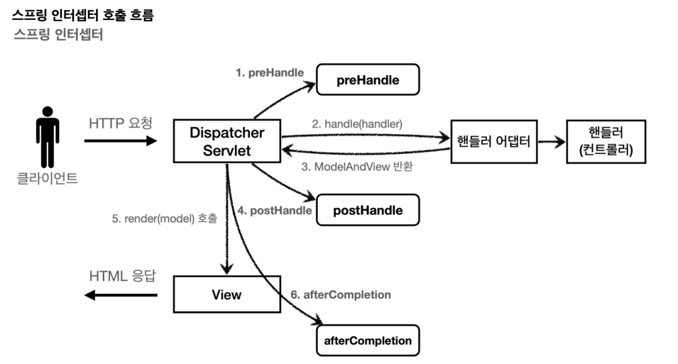
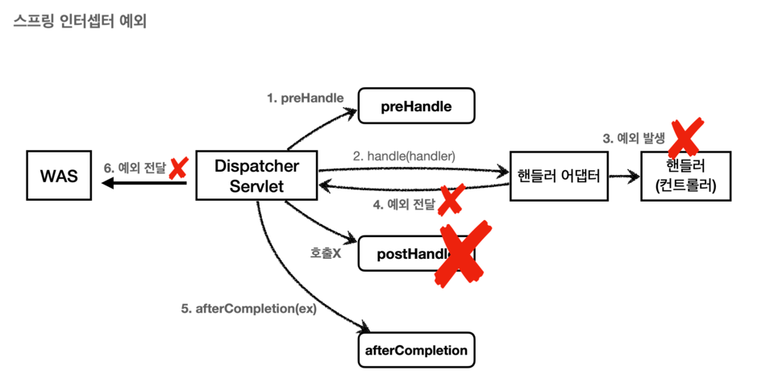

# 12.21 공부내용
### 1. 로그인처리  
로그인 시도한 ID로 대상을 조회하고 입력한 패스워드와 비교하여 일치하면 정상로그인  
일치하지 않으면 bindingResult 통해서 글로벌 오류 발생  

### 2. 쿠키
로그인 상태를 유지하기 위해 쿠키를 사용  

- 영속쿠키 : 만료 날짜 입력 시 해당 날짜까지 유지
- 세션쿠키 : 만료 날짜 생략 시 브라우저 종료시까지 유지

쿠키를 생성하여 넘겨줄 때 HttpServletResponse를 통해 전달  
```
@PostMapping("/login")
    public String login(
        @Validated @ModelAttribute("loginForm") LoginForm loginForm,
        BindingResult bindingResult,
        HttpServletResponse response
        ) {
        
        ...

        //쿠키에 시간정보를 주지 않으면 세션쿠키(브라우저 종료시 쿠키 유효가 만료)
        Cookie idCookie = new Cookie("memberId", String.valueOf(loginMember.getId()));
        response.addCookie(idCookie);

        return "redirect:/";
    }
```

쿠키정보를 통해 로그인에 성공한 회원은 로그인 성공 화면으로 이동  
이때, 쿠키정보는 @CookieValue 어노테이션을 통해 쿠키를 조회할 수 있다.

```
@GetMapping("/")
    public String homeLogin(@CookieValue(name = "memberId", required = false) Long memberId, Model model) {

        if(memberId == null) {
            return "home";
        }

        //로그인된 상태
        Member loginMember = memberRepository.findById(memberId);
        if(loginMember == null) {   //쿠키가 오래돼서 없을 수 있음
            return "home";
        }

        model.addAttribute("member", loginMember);
        return "loginHome";
    }
```

위와 같이 쿠키에 memberId를 넘겨주어 로그인을 유지하게 되면 1,2,3 처럼 단순한 값으로
추측하기 쉽고 **클라이언트에서 쿠키의 값을 변경할 수 있으므로 심각한 보안문제가 된다.**  
#### 대안
- 쿠키에 예측가능하거나 중요정보를 세팅하지 않고 임의의 토큰정보(UUID)를 세팅하고 서버에서 토큰을 관리
- 토큰값이 탈취당해도 재사용이 불가하도록 토큰의 만료시간을 짧게 유지한다.(Ex. 30분)


### 3. 로그아웃처리
쿠키의 종료일자를 0으로 세팅해서 넘겨주기
```
    cookie.setMaxAge(0);
    response.addCookie(cookie);
```
---

# 02.09 공부내용
### 세션
세션을 통해 서버와 클라이언트간 중요정보를 전달하여 관리  

세션을 직접 생성하여 개발  
1. 세션생성
- sessionId 생성(임의의 추정 불가한값으로 생성(UUID))
- 세션저장소(서버)에 sessionId와 보관할 값 저장
- sessionId로 응답쿠키를 클라이언트에 전달
2. 세션조회
- 클라이언트가 요청한 sessionId의 쿠키값으로 세션저장소(서버)에서 보관한 값 조회
3. 세션만료
- 클라이언트가 요청한 sessionId의 쿠키값으로 세션저장소(서버)에서 sessionId와 보관한 값 제거

**테스트시에는 HttpServletResponse, HttpServletRequest 를 직접 사용할 수 없으므로 MockHttpServletRequest, Response를 사용**

### 스프링 세션
스프링에서는 @SessionAttribute를 통해 세션을 편리하게 사용할 수 있도록 지원  
```
@GetMapping("/")
    public String homeLoginV3Spring(
        @SessionAttribute(name = SessionConst.LOGIN_MEMBER, required = false) Member member,
        Model model) {

        //세션에 회원데이터가 없으면 home
        if(member == null) {
            return "home";
        }

        //세션이 유지되면 로그인으로 이동
        model.addAttribute("member", member);
        return "loginHome";
    }
```

### 세션의 타임아웃
세션은 메모리에 생성하므로 특정시간이 지나면 삭제가 필요하다.  
기본 조건은 30분 유지이고 지나면 삭제된다.
```
session.setMaxInactiveInterval(1800); //1800초
```
보통 30분마다 세션정보를 삭제한다면 세션을 사용중이더라도 30분마다 삭제되어 클라이언트 입장에서 번거러움이 있어 
최근 세션요청시간으로 부터 30분뒤에 세션을 삭제하는 방식 택함

---

# 02.23 공부내용  

특정 페이지에 접속시 로그인한 사용자에 한해서 접속이 가능한 URL이라면 로그인 여부 체크 필요  
공통 관심사를 AOP를 통해 구현 가능하지만 웹과 관련된 공통 관심사는 서블릿 필터 또는 스프링 인터셉터를 사용하는게 좋다.  

## 서블릿 필터  
### 필터 흐름  
HTTP 요청 &rarr; WAS &rarr; 필터 &rarr; 서블릿 &rarr; 컨트롤러  
### 필터 제한
HTTP 요청 &rarr; WAS &rarr; 필터(적절하지 않은 요청이라 판단, 서블릿 호출x) //비로그인 사용자  

### 필터 인터페이스
필터 인터페이스를 구현하고 등록하면 서블릿 컨테이너가 필터를 싱글톤 객체로 생성하고, 관리한다.  
- `init():` 필터 초기화 메서드, 서블릿 컨테이너가 생성될 때 호출된다.  
- `doFilter():` 고객의 요청이 올 때 마다 해당 메서드가 호출된다. 필터의 로직을 구현하면 된다.  
- `destroy():` 필터 종료 메서드, 서블릿 컨테이너가 종료될 때 호출된다.  

**참고**  
다중 스레드에서 HTTP 요청시 같은 요청의 로그에 구분이 쉽도록 같은 식별자를 자동으로 남기는 방법으로 logback mdc가 있다.  

## 스프링 인터셉터  
### 스프링 인터셉터 흐름  
HTTP 요청 &rarr; WAS &rarr; 필터 &rarr; 서블릿 &rarr; 스프링 인터셉터 &rarr; 컨트롤러  
### 스프링 인터셉터 제한  
HTTP 요청 &rarr; WAS &rarr; 필터 &rarr; 서블릿 &rarr; 스프링 인터셉터(적절하지 않은 요청이라 판단, 컨트롤러 호출x) //비로그인 사용자  

### 스프링 인터셉터 인터페이스  
#### 정상흐름  
- `preHandle` : 컨트롤러 호출 전에 호출된다. (더 정확히는 핸들러 어댑터 호출 전에 호출된다.)  
`preHandle` 의 응답값이 `true` 이면 다음으로 진행하고, `false` 이면 더는 진행하지 않는다. `false` 인
경우 나머지 인터셉터는 물론이고, 핸들러 어댑터도 호출되지 않는다. 그림에서 1번에서 끝이 나버린다.  
- `postHandle` : 컨트롤러 호출 후에 호출된다. (더 정확히는 핸들러 어댑터 호출 후에 호출된다.)  
- `afterCompletion` : 뷰가 렌더링 된 이후에 호출된다.  

  

#### 예외 발생  
- `preHandle` : 컨트롤러 호출 전에 호출된다.  
- `postHandle` : 컨트롤러에서 예외가 발생하면 `postHandle` 은 호출되지 않는다.  
- `afterCompletion` : `afterCompletion` 은 항상 호출된다. 이 경우 예외(`ex` )를 파라미터로 받아서 어떤 예
외가 발생했는지 로그로 출력할 수 있다. (예외가 발생되어도 호출)  

